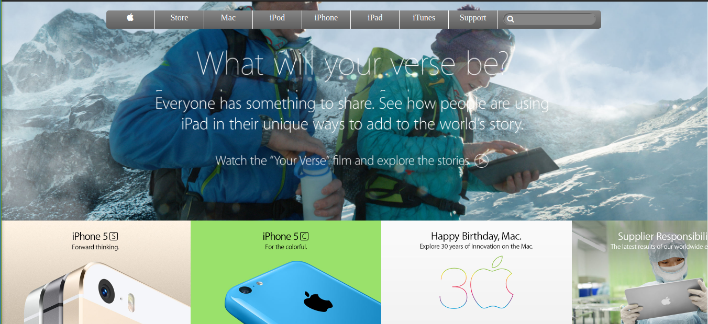

# apple-old-webpage

This project was created  for educational purpose for  practicing the Gradients and backgrounds in HTML and CSS 
 we did that using an example of [apple old page](https://web.archive.org/web/20140301004610/http://www.apple.com)  

## Built With

- HTML
- CSS

## Live Demo

[Live Demo Link](https://serene-rosalind-e3531b.netlify.app/)

## Getting Started

**To view this project, download the contents of the repository to your computer or clone the repository and open the index.html file using your preferred browser.**

## Authors

¤ **MUGIRASE Emmanuel**

- Github: [@descholar-ceo](https://github.com/descholar-ceo)
- Linkedin : [@MUGIRASE Emmanuel](https://www.linkedin.com/in/mugirase-emmanuel-a90b49143/)
- Twitter: [@descholar](https://twitter.com/@descholar3)

¤ **Razika**

- Github: [@rahalrazika](https://github.com/rahalrazika)
- Linkedin : [@razika rahal](https://www.linkedin.com/in/razika-rahal-85539bbb/)
- Twitter: [@RereRere055](https://twitter.com/RereRere055)

##  Contributing

Contributions, issues and feature requests are welcome!

## Show your support

Give a  if you like this project

## Acknowledgments

- [Microverse](https://microverse.org)

## Licenes 
- This project is [MIT](https://github.com/microverseinc/readme-template/blob/master/lic.url) licensed.

